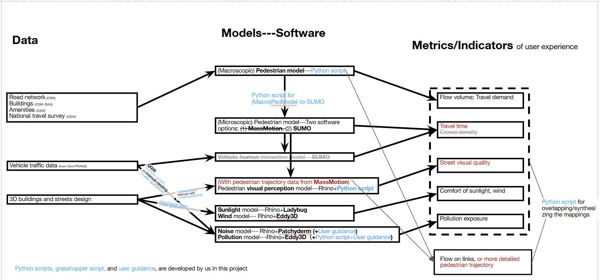
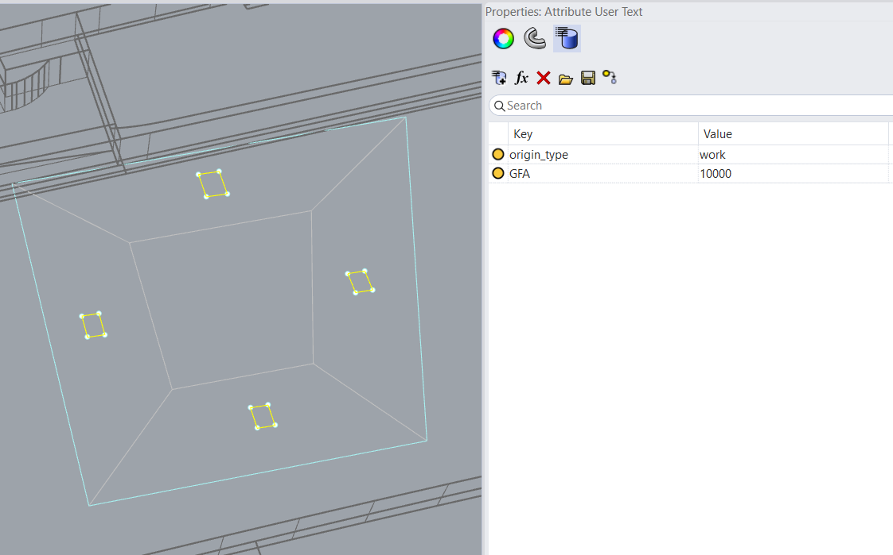

# Multisensory Digital Twins — documentation

Combined guide for the **multisensory user experience assessment** framework (urban digital twin + pedestrian / environmental models).

Python scripts, Grasshopper scripts, and user guidance bridging the tools are developed in this project.

## Contents

| § | Topic | Status |
|---|-------|--------|
| [0](#0-overall-framework) | Overall framework | Draft |
| [1](#1-file-preparation) | File preparation for design alternatives | Draft |
| [2](#2-macroscopic-pedestrian-flow) | Macroscopic pedestrian flow | Simplified |
| [3](#3-microscopic-pedestrian-flow) | Microscopic pedestrian flow | Simplified |
| [4](#4-sunlight) | Sunlight / solar access | Simplified |
| [5](#5-outdoor-wind) | Outdoor wind | Simplified |
| [6](#6-traffic-pollution-cfd) | Traffic pollution CFD | Simplified |
| [7](#7-heat) | Heat | Simplified |
| [8](#8-noise) | Noise | Simplified |

<hr style="border: none; border-top: 3px solid currentColor; margin: 1.5em 0;" />

## 0. Overall framework

High-level description of how urban data, simulation models, and UX metrics connect in this project.



*Figure — overall framework*

---

### Purpose

Assess **multisensory pedestrian / street-level user experience** in a design or case-study area by combining:

- pedestrian demand and movement,
- visual quality of the streetscape,
- outdoor environmental conditions (sunlight, wind, noise, pollution),

into comparable **maps / indicators** that can be overlaid and synthesised.

<!-- TODO: 1–2 sentences on case study (e.g. Amsterdam Zuidas), research questions, and intended users of the framework. -->

---

### Three columns (as in the diagram)

```text
  Data  →  Models / software  →  Metrics / indicators of user experience
```

| Column | Role |
|--------|------|
| **Data** | Urban infrastructure, traffic, and 3D design inputs |
| **Models — software** | Pedestrian + environmental simulations (with custom bridges) |
| **Metrics / indicators** | Quantities used to describe UX; most are synthesised by a shared Python overlay step |

Custom pieces developed in this project (per diagram footer):

- Python scripts
- Grasshopper scripts
- User guidance / manual editing steps

---

### Data (inputs)

| Data group | Sources (from diagram) | Used by | Notes / TODO |
|------------|------------------------|---------|--------------|
| Urban infrastructure | Road networks (OSM); buildings (OSM + BAG); amenities (OSM); national travel survey (ODiN) | Macroscopic pedestrian model | <!-- fill paths, CRS, year --> |
| Traffic data | OmniTRANS | Microscopic pedestrian model (and pollution / exposure chain) | <!-- fill --> |
| Design data | 3D buildings and streets | Visual perception; sunlight; wind; noise; pollution | Rhino / design files |

**Coordinate systems / units:** <!-- TODO -->

**Case folders / shared naming:** <!-- TODO -->

---

### Software 

Three main software programmes, which can also be seen as 'platforms', are used. They are
***Rhino*** (including Rhino's plugin -- *Grasshopper*, and Grasshopper's plugins --- *Eddy3D, Patchderm, Ladybug*), 
***SUMO***, and ***Python*** 

We realize that for non-technical readers, the differences between *models*, *algorithms*, and *software programmes* may be ambguis. xxx xxx xxx xxx xxx xxx.
<!-- For designers, software programmes are easy to understand, yet models -->


#### Pedestrian chain

| Model | Software / scripts | Inputs | Outputs (diagram) |
|-------|-------------------|--------|-------------------|
| **(Macroscopic) pedestrian model** | Python script | Urban infrastructure (+ ODiN) | Flow volume; travel demand → also feeds macro→micro |
| **MacroPed → SUMO** | Python conversion script | Macro outputs | Demand / network for SUMO |
| **(Microscopic) pedestrian model** | MassMotion **or** SUMO | Macro conversion + traffic data | Travel time; detailed flow / trajectories |
| Vehicle–human interaction | SUMO *(crossed out on diagram — not active)* | — | — |

See: [§2 Macroscopic pedestrian flow](#2-macroscopic-pedestrian-flow).  
Micro workflow: <!-- TODO link when written -->

#### Visual perception

| Model | Software | Inputs | Output |
|-------|----------|--------|--------|
| Pedestrian visual perception | Rhino + Python | Design 3D + MassMotion trajectories | Street visual quality |

<!-- TODO: VISUAL_PERCEPTION_WORKFLOW.md -->

#### Environmental models

| Model | Software | Notes | UX metric |
|-------|----------|-------|-----------|
| **Sunlight** | Rhino + Ladybug | [§4 Sunlight](#4-sunlight) | Comfort of sunlight (with wind) |
| **Wind** | Rhino + Eddy3D | [§5 Wind](#5-outdoor-wind) | Comfort of sunlight / wind |
| **Noise** | Rhino + Pachyderm | User guidance | Pollution exposure *(grouped with air pollution on diagram)* |
| **Pollution** | Rhino + Eddy3D (+ OpenFOAM / Python) | [§6 Pollution](#6-traffic-pollution-cfd); Python + user guidance | Pollution exposure |

QGIS, Python, Grasshopper, and manual reading/editing appear as **bridges** between data and models (see diagram arrows).

---

### Metrics / indicators of user experience

Most indicators feed a shared **Python script for overlapping / synthesising the mappings** (dashed box on the diagram).

| Indicator | Primary model(s) | In synthesis box? | Doc |
|-----------|------------------|-------------------|-----|
| Flow volume; travel demand | Macroscopic ped | Yes | [§2 Macroscopic pedestrian flow](#2-macroscopic-pedestrian-flow) |
| Travel time | Microscopic ped | Yes | <!-- TODO --> |
| Crowd density | Micro *(crossed out)* | — | Not used |
| Street visual quality | Visual perception | Yes | <!-- TODO --> |
| Comfort of sunlight, wind | Sunlight + wind | Yes | [§4 Sunlight](#4-sunlight) / [§5 Wind](#5-outdoor-wind) |
| Pollution exposure | Noise + pollution | Yes | [§6 Pollution](#6-traffic-pollution-cfd); noise TBD |
| Flow on links / detailed trajectories | Microscopic ped | No (separate detailed ped data) | <!-- TODO --> |

**Synthesis script location / name:** <!-- TODO -->

**How overlays are defined (grid, pedestrian probes, link aggregation, weights):** <!-- TODO -->

---

### Recommended reading order

1. [§0 Overall framework](#0-overall-framework) + the figure above  
2. [§1 File preparation](#1-file-preparation)  
3. Pedestrian demand: [§2 Macroscopic pedestrian flow](#2-macroscopic-pedestrian-flow)  
4. Environment: [§5 Wind](#5-outdoor-wind) → [§6 Pollution](#6-traffic-pollution-cfd) (pollution builds on wind) and [§4 Sunlight](#4-sunlight) in parallel  
5. Micro / heat / noise / synthesis when those sections are filled  

---

### Open items

- [ ] Case study boundary and design scenarios  
- [ ] Naming of shared probe points / grids across wind, sun, pollution  
- [ ] Definition of “comfort” thresholds (wind, sun)  
- [ ] Weighting or multi-criteria rule in the synthesis script  
- [ ] Which micro tool is default for a given scenario (MassMotion vs SUMO)  
- [ ] Status of crossed-out diagram elements (vehicle–human; crowd density)  

---

*Draft scaffold aligned with `framework_overall.png`. Fill TODOs as workflows are documented.*

<hr style="border: none; border-top: 3px solid currentColor; margin: 1.5em 0;" />

## 1. File preparation

For each **design proposals or alternative**, we need the following files for assessment.

### 1.1 Macro pedestrian flow simulation

Aspects involved: road networks, building quantities, building functions, transport nodes, parking space, and areas of green/sport parks. The required data include 2D lines of building profiles and Center lines of new roads are needed:

#### 1.1.1 2D lines of building profiles (Figure 1)

Provide 2D building profile lines with **attribute user text** documenting:

- `origin_type`
- `GFA`

The example in Figure 1 is in the default Rhino format (`.3dm`). If you do not use Rhino, any common 2D format is fine (e.g. `dwg`, `dxf`, `shp`). Document the building information (`attribute user text`, `origin_type`, `GFA`) in a logical way for that format.

Our pedestrian model snaps each building’s information to its nearest road links. Therefore, for large buildings, to make the simulation more accurate, we suggest separating them into **sub-buildings**.

In Figure 1:

- Blue line = large building profile
- Yellow box lines = sub-buildings (information is stored on these)
- Example: whole building = 40 000 m² → each sub-building = 10 000 m²

**Allowed values of `origin_type`:**

`home`, `work`, `education`, `shopping`, `leisure` (assembly venues, hospitality, parks), `sport`, `healthcare`, `other`, `car_parking`, `bicycle_parking`, `motorcycle_parking`, `train_station`, `subway_station`, `tram_stop`, `bus_stop`



*Figure 1 — 2D building profiles with `origin_type` and `GFA` (Attribute User Text)*

#### 1.1.2 Center lines of new roads (Figure 2)


*Figure 2 — center lines of new roads*

### 1.2 Sunlight, wind, pollution, and heat analysis

3D building geometry is involved.

- **3D buildings** — As abstract or detailed as the buildings in Figure 2. Rhino (`.3dm`) is preferred; SketchUp or other common formats are also fine, as long as they can be imported into Rhino.

### 1.3 Visual assessment

Provide the following on **separate layers** in 3D files:

- Walkable areas (e.g. sidewalks, squares)
- Trees
- 3D buildings


<hr style="border: none; border-top: 3px solid currentColor; margin: 1.5em 0;" />

## 2. Macroscopic pedestrian flow

Demand generation and network assignment → **flow volume** and **travel demand** (feeds micro conversion).

### Data

Uses the building profiles, road centerlines, and related design inputs from [§1](#1-file-preparation), together with the study-area road network, amenities, and ODiN trip rates (and optional BAG building data where needed).

### Model / software settings

| Item | Setting / note |
|------|----------------|
| Software | Python (`PedModel` / `main.py`, `modules/`) |
| Run entry | `main.py` and/or `X_script_run.sh` |
| Pipeline (high level) | Network → land use → ODiN rates → trip generation → assignment → export |
| Main outputs | Link flows (by hour); OD / travel demand |
| Downstream | Optional MacroPed → SUMO / MassMotion conversion |
| UX handoff | Flow volume & travel demand → synthesis overlay |


<hr style="border: none; border-top: 3px solid currentColor; margin: 1.5em 0;" />

## 3. Microscopic pedestrian flow

Detailed pedestrian simulation (MassMotion and/or SUMO), fed by macro demand.

### Data

Uses the design geometry from [§1](#1-file-preparation) and demand / network exports from [§2](#2-macroscopic-pedestrian-flow). Traffic data (e.g. OmniTRANS) may be added where needed.

### Model / software settings

| Item | Setting / note |
|------|----------------|
| Software | MassMotion **or** SUMO |
| Bridge from macro | Python MacroPed → SUMO conversion (path TBD) |
| Main outputs | Travel time; detailed flows / trajectories |
| Downstream | Visual perception; synthesis |


To connect the Macroscopic pedestrian flow output data, as input for this Microscopic pedestrian simulation, use xxx xxx xxx.


<hr style="border: none; border-top: 3px solid currentColor; margin: 1.5em 0;" />


## 4. Sunlight

Solar access / radiation / shade for outdoor comfort (**comfort of sunlight**, with wind).

### Data

Uses the 3D buildings (and related design layers) from [§1](#1-file-preparation), plus a climate file (EPW or equivalent). Prefer the same pedestrian analysis grid / probes as wind and pollution.

### Model / software settings

| Item | Setting / note |
|------|----------------|
| Software | Rhino + Ladybug (+ Grasshopper) |
| Analysis period | <!-- TODO --> |
| Analysis type | <!-- TODO: direct sun hours / radiation / shade --> |
| Main outputs | Sunlight / radiation maps or probe values |
| UX handoff | Comfort of sunlight (joint with wind) → synthesis |


<hr style="border: none; border-top: 3px solid currentColor; margin: 1.5em 0;" />

## 5. Outdoor wind

Outdoor wind field and comfort indicators; also the base case for pollution CFD.

### Data

Uses the 3D buildings / streets from [§1](#1-file-preparation), plus wind climate (EPW / wind rose). Prefer the same pedestrian probe points as pollution and synthesis.

### Model / software settings

| Item | Setting / note |
|------|----------------|
| Software | Rhino + Eddy3D → OpenFOAM (via Eddy3D) |
| Case layout | Wind-direction angle subfolders (e.g. `230/`) |
| Main field | `U` (and turbulence fields as needed) |
| Probing | e.g. `system/ttt` → `postProcessing/ttt/<time>/U` |
| Important | Do **not** let Eddy3D rewrite `system/` during a custom OpenFOAM run |
| Downstream | Pollution (§6); comfort of sunlight / wind → synthesis |


<hr style="border: none; border-top: 3px solid currentColor; margin: 1.5em 0;" />

## 6. Traffic pollution CFD

Passive-scalar traffic pollution on top of an Eddy3D wind case (OpenFOAM 8 / blueCFD).

### Data

Uses a finished wind case from [§5](#5-outdoor-wind) (mesh + usable `U` field) and the design / road geometry from [§1](#1-file-preparation) to define road emission volumes. Probe at the same pedestrian points as wind.

### Model / software settings

| Item | Setting / note |
|------|----------------|
| Software | OpenFOAM.org **8** (blueCFD-Core); `simpleFoam` + `scalarTransport` |
| Pollutant field | Scalar `s` (relative concentration; emission rate placeholder) |
| Emission source | `semiImplicitSource` on cellSet `roadEmissions` (nested in `controlDict`) |
| Numerics | `div(phi,s) bounded Gauss upwind`; solver entry for `s` in `fvSolution` |
| Run tip | Prefer **frozen / healthy** wind; avoid long coupled runs that blow up `k`/`ε` |
| Safety | `runTimeModifiable false`; do not let Eddy3D overwrite `system/` mid-run |
| Scripts | `230_run_topoSet.bat`, `230_run_sim.bat`, `230_run_postprocess_s.bat`, `probe_s_to_gh.py` |
| Main outputs | Probe `s` → `s_gh.txt` for Grasshopper (same point order as wind) |
| UX handoff | Pollution exposure → synthesis |


<hr style="border: none; border-top: 3px solid currentColor; margin: 1.5em 0;" />

## 7. Heat

Outdoor heat / thermal comfort assessment.

### Data

Uses the design geometry from [§1](#1-file-preparation) and a climate file (EPW or equivalent). Prefer the same analysis grid as wind / sun / pollution.

### Model / software settings

| Item | Setting / note |
|------|----------------|
| Software | <!-- TODO --> |
| Main outputs | Heat / comfort maps or probe values |
| UX handoff | <!-- TODO --> → synthesis |


<hr style="border: none; border-top: 3px solid currentColor; margin: 1.5em 0;" />

## 8. Noise

Noise assessment (Rhino + Pachyderm on the framework diagram).

### Data

Uses the design geometry from [§1](#1-file-preparation), plus noise-source assumptions (TBD). Prefer the same receiver grid as other environmental layers.

### Model / software settings

| Item | Setting / note |
|------|----------------|
| Software | Rhino + Pachyderm |
| Main outputs | Noise / exposure maps or probe values |
| UX handoff | Often grouped with pollution exposure → synthesis |


Note: In Pachyderm, set the resoluton to be large, like 500cm, otherwise it will be too slow to run for outdoor scenes.